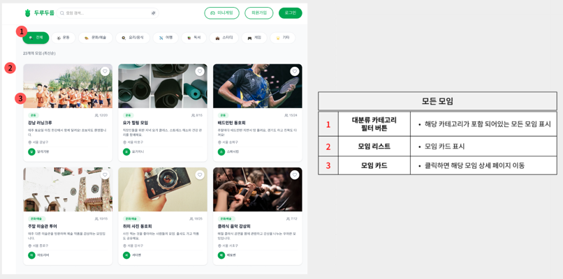
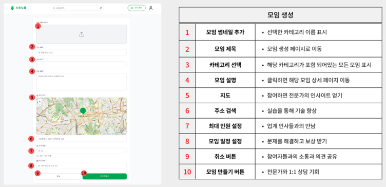
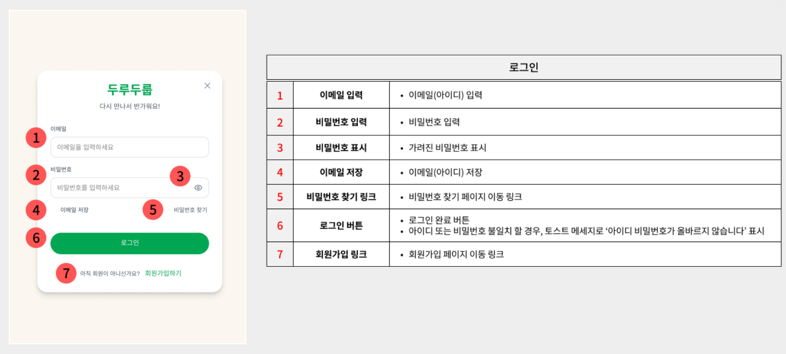
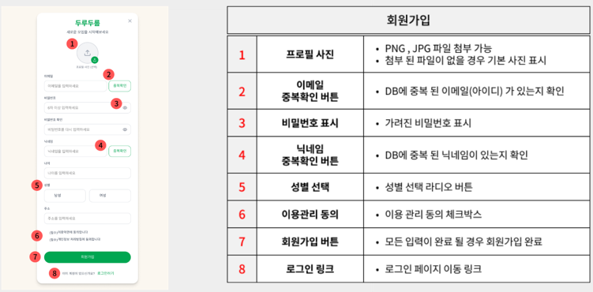
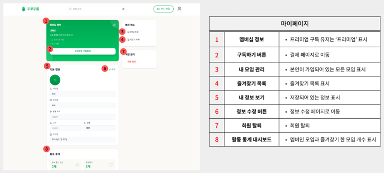
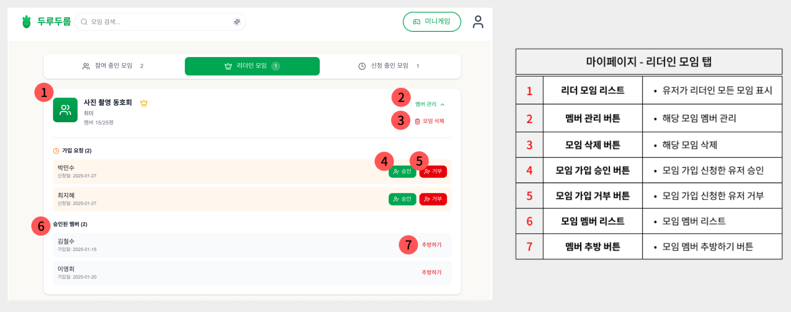
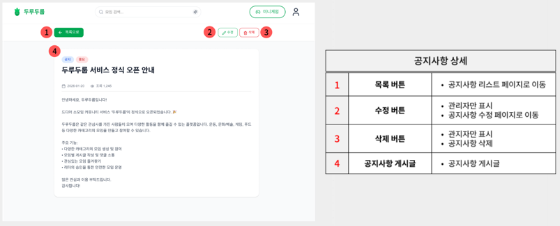
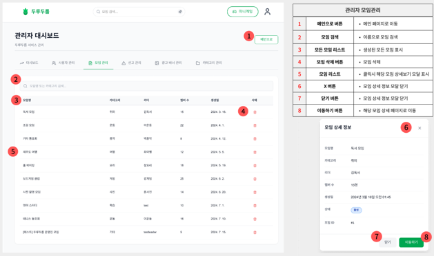

# **프로젝트 : 두루두룹 (DuruDurub) - React 리팩토링** 👥

<p align="center">
  
</p>

> 관심사가 같은 사람들과 모여 새로운 경험을 만들어가는 **소셜 모임 플랫폼**
> 
> 기존 Thymeleaf 기반 프로젝트를 **React + Spring Boot REST API** 로 프론트/백 분리 리팩토링

<br>

## 📌 시연 영상

[](https://www.youtube.com/watch?v=yVU2fAoMcvc)

> ⬆️ 이미지를 클릭하면 시연 영상으로 이동합니다.

<br>

---

## 📋 목차
- [1. 프로젝트 개요](#1-프로젝트-개요)
- [2. 프로젝트 구조](#2-프로젝트-구조)
- [3. 팀 구성 및 역할](#3-팀-구성-및-역할)
- [4. 기술 스택](#4-기술-스택)
- [5. 프로젝트 수행 경과](#5-프로젝트-수행-경과)
- [6. 핵심 기능 코드 리뷰](#6-핵심-기능-코드-리뷰)
- [7. 화면 UI](#7-화면-ui)
- [8. 자체 평가 의견](#8-자체-평가-의견)

---

<br>

## 1. 프로젝트 개요

### 1-1. 프로젝트 주제
- 관심사 기반 소셜 모임 플랫폼 **"두루두룹"** — React 리팩토링 버전

### 1-2. 주제 선정 배경
- 코로나 이후 오프라인 만남에 대한 수요 증가
- 기존 소셜 플랫폼의 한계점 (카테고리 세분화 부족 등)

### 1-3. 기획 의도
- 누구나 쉽게 관심사 기반 모임을 만들고 참여할 수 있는 플랫폼
- AI 검색을 통한 맞춤형 모임 추천

### 1-4. 리팩토링 목적
- 기존 Thymeleaf 서버 사이드 렌더링 → **React SPA + REST API** 분리
- 세션 기반 인증 → **JWT 토큰 기반 인증**으로 전환
- Figma 디자인 기반 **최신 UI/UX** 적용 (Tailwind CSS, Radix UI, shadcn/ui)

### 1-5. 기대효과
- 프론트/백 독립 개발로 생산성 향상
- JWT 기반 Stateless 인증으로 확장성 확보
- React 컴포넌트 재사용으로 유지보수성 향상

<br>

---

## 2. 프로젝트 구조

### 2-1. 주요 기능
| 구분 | 기능 |
|:---:|:---|
| 👤 사용자 | 회원가입 / 로그인 (JWT 토큰 인증) |
| 🔍 모임 탐색 | 카테고리별 모임 목록 / 모임 상세 조회 |
| 🤖 AI 검색 | OpenAI API 기반 맞춤형 모임 검색 |
| ❤️ 즐겨찾기 | 관심 모임 좋아요 / 즐겨찾기 목록 관리 |
| 📝 게시판 | 모임 내 게시글 / 댓글 작성 및 좋아요 |
| 🗺️ 지도 | Leaflet.js 기반 모임 위치 표시 |
| 💳 결제 | Toss Payments 연동 프리미엄 구독 |
| 🎮 미니게임 | 랜덤 미니게임 |
| 🔔 공지사항 | 공지 등록 / 조회 / 수정 / 삭제 |
| 🛡️ 관리자 | 회원 관리 / 모임 관리 / 배너 관리 / 신고 관리 |

### 2-2. 메뉴 구조도
<details>
  <summary>메뉴 구조도 펼치기</summary>
  
  
</details>

<br>

---

## 3. 팀 구성 및 역할

| 이름 | 역할 | 담당 업무 |
|:---:|:---:|:---|
| **안영아** | 팀장 | • <!-- 담당 업무 1 --><br>• <!-- 담당 업무 2 --> |
| **김현수** | 팀원 | • <!-- 담당 업무 1 --><br>• <!-- 담당 업무 2 --> |
| **박희진** | 팀원 | • <!-- 담당 업무 1 --><br>• <!-- 담당 업무 2 --> |
| **최영우** | 팀원 | • Thymeleaf → React 프론트엔드 전환<br>• REST API 설계 및 구현<br>• Tailwind CSS + Radix UI 경로 재설정 및 적용 |

> 💡 인원 : **4명 (팀 리팩토링)** &nbsp;|&nbsp; 기간 : **2026.02 ~ 2026.03**

<br>

---

## 4. 기술 스택

### Frontend
<div align="left">
  
  
  
  
  
  
  
</div>

### Backend
<div align="left">
  
  
  
  
  
</div>

### Database
<div align="left">
  
</div>

### API / Service
<div align="left">
  
  
  
</div>

### Tools
<div align="left">
  
  
  
  
  
</div>

### Architecture
```
durudurub/                          ← Spring Boot 백엔드 (REST API)
├── src/main/java/.../
│   ├── config/                     ← Security, Web, CORS 설정
│   ├── controller/                 ← REST API 컨트롤러
│   ├── dao/                        ← MyBatis Mapper 인터페이스
│   ├── dto/                        ← 데이터 전송 객체
│   ├── security/                   ← JWT 인증 필터 & 토큰 유틸
│   └── service/                    ← 비즈니스 로직
├── src/main/resources/
│   ├── mybatis/mapper/             ← SQL 매퍼 XML
│   └── application.properties      ← JWT 시크릿, DB 설정
└── uploads/                        ← 업로드 파일 저장소

durudurub-app/                      ← React 프론트엔드 (Vite + TypeScript)
├── src/
│   ├── api/                        ← Axios API 호출 모듈
│   ├── components/                 ← 공통 UI 컴포넌트 (Navbar 등)
│   ├── contexts/                   ← AppContext (JWT 인증 상태 관리)
│   ├── pages/                      ← 페이지별 컴포넌트
│   ├── layouts/                    ← 레이아웃 컴포넌트
│   ├── routes.tsx                  ← React Router 라우팅 설정
│   └── App.tsx                     ← 앱 진입점
├── package.json                    ← 의존성 관리
└── vite.config.ts                  ← Vite 빌드 설정
```

### 기존 프로젝트 대비 변경점
| 구분 | 기존 (TeamProject1) | 리팩토링 (mini2) |
|:---:|:---:|:---:|
| 프론트엔드 | Thymeleaf (SSR) | React + Vite (SPA) |
| 스타일링 | 순수 CSS | Tailwind CSS + Radix UI |
| 인증 방식 | Spring Security 세션 | JWT 토큰 |
| 통신 방식 | 폼 서밋 + 일부 fetch | Axios REST API |
| 지도 | Kakao Maps API | Leaflet.js |
| 프로젝트 구조 | 모놀리식 | 프론트/백 분리 |

<br>

---

## 5. 프로젝트 수행 경과

### 5-1. 요구사항 & 기능 정의서
<details>
  <summary>요구사항 및 기능 정의서 펼치기</summary>
  
  
  
  
  
</details>

### 5-2. ERD
<details>
  <summary>ERD 펼치기</summary>
  
  
</details>

<br>

---

## 6. 핵심 기능 코드 리뷰

### 6-1. JWT 인증 시스템
> Spring Security + JWT 토큰 기반 Stateless 인증

<details>
  <summary>코드 보기</summary>

```java
// JWT 인증 필터 핵심 로직

```
</details>

### 6-2. React Context 기반 인증 상태 관리
> AppContext + useApp() 훅을 활용한 전역 인증 상태 관리

<details>
  <summary>코드 보기</summary>

```tsx
// AppContext.tsx 핵심 로직

```
</details>

### 6-3. AI 검색 기능 (OpenAI API)
> 사용자의 자연어 검색어를 OpenAI API로 분석하여 맞춤형 모임을 추천합니다.

<details>
  <summary>코드 보기</summary>

```java
// AiSearchController.java 핵심 로직

```
</details>

### 6-4. Toss Payments 결제 연동
> 프리미엄 구독을 위한 결제 시스템

<details>
  <summary>코드 보기</summary>

```java
// PaymentController.java 핵심 로직

```
</details>

<br>

---

## 7. 화면 UI

### 메인 화면
<details>
  <summary>메인 화면 보기</summary>
  
  
</details>
<br>

### 모임 탐색 (Explore)
<details>
  <summary>모임 탐색 화면 보기</summary>
  
  
</details>
<br>

### 모임 상세
<details>
  <summary>모임 상세 화면 보기</summary>
  
  <br>
  
</details>
<br>

### AI 검색
<details>
  <summary>AI 검색 화면 보기</summary>
  
  
</details>
<br>

### 로그인 / 회원가입
<details>
  <summary>로그인 / 회원가입 화면 보기</summary>
  
  <br>
  <br>
  
</details>
<br>

### 마이페이지
<details>
  <summary>마이페이지 화면 보기</summary>
  
  <br>
  <br>
  <br>
  <br>
  
</details>
<br>

### 결제 (구독)
<details>
  <summary>결제 화면 보기</summary>
  
  
</details>
<br>

### 공지사항 페이지
<details>
  <summary>공지사항 페이지 화면 보기</summary>
  
  <br>
  <br>
  
</details>

### 관리자 페이지
<details>
  <summary>관리자 페이지 화면 보기</summary>
  
  <br>
  <br>
  <br>
  
</details>
<br>

<br>

---

## 8. 자체 평가 의견

### 8-1. 개별 평가

**안영아**
 - <!-- 소감 -->

**김현수**
 - <!-- 소감 -->

**박희진**
 - <!-- 소감 -->

**최영우**
> - Thymeleaf 기반 프로젝트를 React SPA로 전환하며 프론트/백 분리 아키텍처를 경험했습니다.
> - JWT 인증 시스템을 직접 구축하며 토큰 기반 인증의 흐름을 이해했습니다.

### 8-2. 종합 평가

**잘된 점**
- 프론트엔드와 백엔드를 성공적으로 분리하여 SPA 구조로 전환
- JWT 기반 Stateless 인증 구현
- Tailwind CSS + Radix UI를 활용한 현대적 UI 구성

**한계점**
- 시간 부족으로 AI 검색의 mcp 활용 미구현
- 결제 모듈 실행 시, 테스트 키를 사용해 실제 결제로 이어지지 않았음

**개선점**
- <!-- 개선점 작성 -->

---

<br>